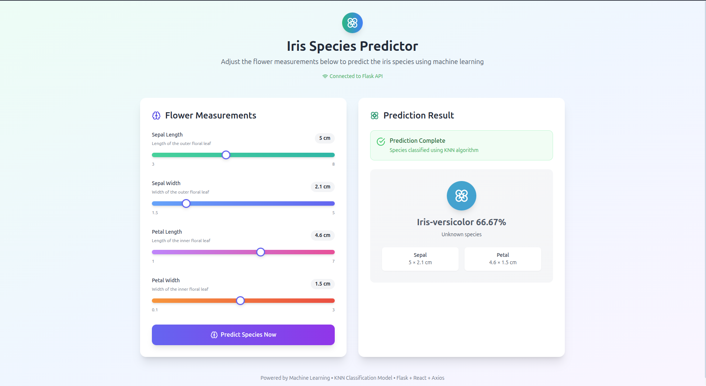

# 🌸 Iris Flower Species Classifier – KNN + Flask + React

Welcome to the **Iris Flower Classification Web App**!  
This project uses **Machine Learning (KNN)** to classify iris species based on user input, with a beautiful and interactive **React + Tailwind CSS frontend** and a **Flask API backend**.



---

## 🌟 Features

- 🔍 **K-Nearest Neighbors (KNN)** classification algorithm
- ⚙️ **GridSearchCV** hyperparameter tuning
- 💻 Flask backend serving predictions from a trained model
- 🎨 Modern and responsive React frontend (Tailwind + Vite)
- 🔄 Real-time predictions with user-controlled sliders
- ✅ Fully open source and beginner-friendly

---

## 🧠 The Model

- **Dataset**: [The Iris Flower Dataset](https://archive.ics.uci.edu/ml/datasets/iris)
- **Target Classes**:
    - Iris Setosa
    - Iris Versicolor
    - Iris Virginica
- **Algorithm**: `KNeighborsClassifier` from Scikit-learn
- **Hyperparameters Tuned**: `n_neighbors`, `weights`, `metric`

---

## 📁 Project Structure

```
Machine-Learning-Iris-Flower-Classification/
│
├── backend/
│   ├── app.py               # Flask backend API
│   └── knn_model.pkl        # Serialized ML model
│
├── frontend-iris-classification/
│   ├── src/
│   │   ├── App.jsx
│   │   ├── main.jsx
│   │   └── services/api.js  # Axios setup for API calls
│   └── index.html
│
├── models/
│   └── model training notebooks and files
│
├── image/
│   └── cb028d7f-7e89-459c-ba81-c1ec10a45c01.png
│
├── requirements.txt
├── README.md
└── sample.ipynb
```

---

## 🚀 How to Run the Project Locally

### 📦 Backend – Flask API

```bash
cd backend
python -m venv venv
source venv/bin/activate
pip install -r ../requirements.txt
python app.py
```

The API will start at `http://127.0.0.1:5000/predict`

---

### 🌐 Frontend – React + Tailwind

```bash
cd frontend-iris-classification
npm install
npm run dev
```

Then visit: `http://localhost:5173`

---

## 📡 API Usage (for devs)

**Endpoint**: `POST /predict`

**Sample Request**:

```json
{
  "features": [5.1, 3.5, 1.4, 0.2]
}
```

**Sample Response**:

```json
{
  "prediction": "Iris-setosa"
}
```

---

## 📸 UI Screenshot

<p align="center">
  
</p>

---

## 🛠️ Tools & Technologies

- 🧠 **scikit-learn**
- 🌐 **Flask**
- ⚛️ **React** (with Vite)
- 💅 **Tailwind CSS**
- 🌈 **Axios** for HTTP communication

---

## 💡 Future Enhancements

- 📈 Add model confidence or probability per class
- 💾 Save user predictions to a database
- 🌍 Multi-language support
- 🔐 User authentication and profile tracking

---

## 🤝 Contributing

Pull requests are welcome! For major changes, open an issue first to discuss what you’d like to change.

---

## 📜 License

This project is open-source under the [MIT License](LICENSE).

---

> Built with ❤️ by Eyob Mulugeta
